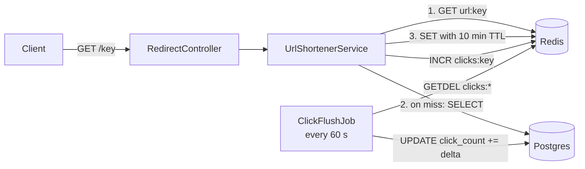

# url-shortener

A URL shortener built with Spring Boot 3: cache-aside reads on Redis, an atomic
rate limiter written in Lua, write-behind click counting, and JWT authentication.

The point of this project was not another CRUD application. It was to work through
the decisions a URL shortener actually makes hard: **keeping a read-modify-write
sequence atomic in Redis, trading counter freshness against write volume, and
exposing metrics you can read a p95 off instead of an average.** The reasoning
behind each of those is in [Design decisions](#design-decisions).

**Status: closed.** No new features — the repository stands as a reference.

## Stack

| Layer | Technology |
|---|---|
| Language / runtime | Java 17 |
| Framework | Spring Boot 3.5.15 (Web, Data JPA, Security, Data Redis, Validation, Actuator) |
| Database | PostgreSQL 16 |
| Cache / counters / limiter | Redis 7 with a Lua script |
| Tokens | jjwt 0.12.6 (HMAC-SHA) |
| Metrics | Micrometer + Prometheus |
| Tests | JUnit 5, Testcontainers, MockMvc |
| Runtime packaging | Docker Compose, multi-stage Dockerfile |

## Quick start

Requires Docker. The application listens on port **8090**.

```bash
cp .env.example .env      # set the database password and a JWT secret (32+ bytes)
docker compose up --build
```

Compose brings up three services — `postgres`, `redis` and `app` — where `app`
waits on the healthchecks of both dependencies (`condition: service_healthy`),
so it never starts against a database that isn't ready.

To run the application outside a container:

```bash
docker compose up -d postgres redis
export SPRING_DATASOURCE_PASSWORD=... APP_JWT_SECRET=...
./mvnw spring-boot:run
```

## API

| Method | Path | Auth | Response |
|---|---|---|---|
| `POST` | `/api/auth/login` | — | `200` with a JWT |
| `POST` | `/api/shorten` | Bearer | `201` with `{shortKey, shortUrl}` |
| `GET` | `/{key}` | — | `302` with `Location` |
| `GET` | `/actuator/health`, `/actuator/prometheus` | — | `200` |

Development user: `admin` / `secret` — an `InMemoryUserDetailsManager` with the
password BCrypt-hashed at startup (see `SecurityConfig`).

```bash
# 1. get a token
TOKEN=$(curl -sX POST localhost:8090/api/auth/login \
  -H 'Content-Type: application/json' \
  -d '{"username":"admin","password":"secret"}' | jq -r .token)

# 2. shorten a URL (limit: 5/min per user)
curl -sX POST localhost:8090/api/shorten \
  -H "Authorization: Bearer $TOKEN" \
  -H 'Content-Type: application/json' \
  -d '{"url":"https://spring.io/projects/spring-boot"}'
# -> 201 {"shortKey":"aB3xY7z","shortUrl":"http://localhost:8090/aB3xY7z"}

# 3. follow the short link (public, no token)
curl -i localhost:8090/aB3xY7z
# -> 302, Location: https://spring.io/projects/spring-boot
```

Error responses: `400` (URL fails `^https?://.+`), `401` (missing or invalid token),
`404` (unknown key), `429` with a `Retry-After` header (rate limit exceeded).

## How it works



**Cache-aside on the read path.** The `key -> url` mapping is immutable, so it
caches without any invalidation logic; the 10-minute TTL exists only so unused
entries release memory.

**Write-behind click counting.** Every redirect does an `INCR` in Redis, and once
a minute the job flushes to Postgres with a single
`UPDATE ... SET click_count = click_count + :delta`. The hot path never touches
the database. The cost is a window of up to a minute where the stored count is stale.

**Token bucket in Lua** (`resources/scripts/token_bucket.lua`) — 5 requests per
minute per user, with identity taken from the `sub` claim of the JWT.

## Design decisions

**Why the limiter is a Lua script rather than a sequence of commands from Java.**
The decision is a read-modify-write over two values (`tokens` and `ts`). Three
separate commands would allow a lost update: two concurrent requests would read the
same state and both would spend the same token. Redis runs the whole script as one
operation, because it is single-threaded and does not interleave a script with
other commands.

**Why the refill rate is passed as two integers rather than a ready-made
"tokens per second".** Five per minute is `0.08333333333333333`. Rounded to seven
digits, the refill after 12 s comes out as `0.9999996` — less than one whole token,
so a request that should pass gets a 429 instead. The error sits in the seventh
decimal place, invisible in a config file. Passing `capacity` and `windowMillis`
separately and dividing once, inside the script, yields `12000 * 5 / 60000` = exactly 1.
The `granicaDolewki` test pins that boundary: 11.9 s is not enough, 12.0 s is.

**Why a new bucket starts full.** Starting empty would mean "your first request
ever gets a 429". A full bucket is also exactly what a long-idle client would see,
which makes the two cases indistinguishable — and that same argument justifies the
TTL: after one window of silence, deleting the key loses no information.

**Why `tokens` and `ts` are always written together, including on a rejection.**
Refreshing the token count while leaving the old timestamp would let the next
request count the same stretch of time a second time, handing out tokens for free.

**Why `GETDEL` instead of `GET` followed by `DEL`.** The flush has to read the
counter and reset it in one step, or an `INCR` landing between the two commands is
lost. One window remains, accepted deliberately: if the `UPDATE` fails after the
`GETDEL`, that delta is gone. For click analytics that is a reasonable trade.

**Why one Timer tagged `cache=hit|miss` instead of two separate metrics.** The
`urlshortener.resolve` Timer with a percentile histogram yields both latency
(p95/p99) and redirect volume (`_count`), and the tag makes the two paths
comparable. The 404 counter sits **deliberately outside** the Timer — a fail-fast
path has a different latency distribution and would drag down the p95 of
successful lookups.

**Why `DispatcherType.ERROR` is `permitAll`.** The internal forward to `/error` is
not a separate user request. Without that rule, stateless security returns 403
instead of the intended 429 or 404.

**Why the Dockerfile is multi-stage.** The builder stage carries Maven and a JDK
(545 MB); the final image carries only a JRE and the jar (394 MB). A single-stage
build would weigh ~900 MB and ship a compiler to production. `ENTRYPOINT` uses exec
form so that `java` is PID 1 and receives `SIGTERM` — in shell form PID 1 would be
`/bin/sh`, which does not forward signals, so `docker stop` would escalate to
`SIGKILL` after 10 seconds.

## Tests

```bash
./mvnw test          # Testcontainers requires a running Docker daemon
```

Every integration test starts its own Postgres and Redis containers, so none of
them assume anything about the local environment. Surefire supplies a throwaway
`APP_JWT_SECRET`, so the suite needs no environment setup of its own — and the
application still refuses to start without a real one.

| Class | What it covers |
|---|---|
| `UrlControllerIntegrationTest` | the HTTP contract: 401 without a token, 201 with one, 302 on `/{key}`, 404 for an unknown key |
| `RateLimiterServiceTest` | seven properties of the token bucket: burst up to capacity, refill and its exact boundary, capacity ceiling, decreasing `Retry-After`, never answering "0 seconds", and rejected requests not consuming tokens |
| `UrlShortenerIntegrationTest` | shorten → resolve round trip |
| `TransactionalBehaviourTest` | two Spring pitfalls measured rather than assumed: self-invocation bypasses the `@Transactional` proxy, and a checked exception does not trigger a rollback |
| `NPlusOneTest` | reads `PrepareStatementCount` off the Hibernate `SessionFactory` to demonstrate N+1 as a number, not an assertion |

Injecting the clock as an argument (`allowTokenBucket(..., long nowMillis)`) is what
makes token refill testable without waiting in real time.

## Configuration

Every sensitive value comes from the environment. `.env` is gitignored; only
`.env.example` is committed.

| Variable | Meaning |
|---|---|
| `SPRING_DATASOURCE_PASSWORD` | Postgres password (same value as `POSTGRES_PASSWORD`) |
| `APP_JWT_SECRET` | HMAC signing secret, 32 bytes minimum |
| `APP_CLICK_FLUSH_RATE_MS` | click flush interval, defaults to 60000 |

The signing algorithm is not configured anywhere: `Keys.hmacShaKeyFor` picks the
strongest HMAC variant the key length allows, so a 64-byte secret yields HS512
and a 32-byte one HS256. Measured on a running instance, the token header reads
`{"alg":"HS512"}`.

`APP_JWT_SECRET` has **no default value**, so a missing secret stops the
application from starting. Silently falling back to a well-known token-signing key
is precisely the class of bug that reaches production unnoticed.

## Known limitations

Deliberate rather than overlooked — this is an exercise, not a production system.

- **`ClickFlushJob` uses `KEYS clicks:*`.** Production would need `SCAN`; `KEYS`
  blocks single-threaded Redis for the length of a full keyspace walk.
- **The flush is not idempotent.** A failure between `GETDEL` and `UPDATE` drops
  one delta, as described above.
- **Key generation is random with a retry loop.** Seven base62 characters give
  ~3.5·10¹² combinations, and `existsByShortKey` checks for a collision before
  insert — but there is a race window between that check and the `INSERT`. The
  unique index on `short_key` closes it, at the cost of an exception rather than
  a retry.
- **Users live in memory.** A single `admin` account in `SecurityConfig`, with no
  users table, no registration and no password rotation. Tokens carry no roles and
  there is no refresh token.
- **Single instance assumed.** The scheduler holds no distributed lock, so two
  replicas would both flush the counters concurrently.
- **`Author` and `Book`** are not part of the shortener domain; they exist purely
  as fixtures for `NPlusOneTest`.
- **`RateLimiterService.allow()`** is the earlier fixed-window limiter, kept for
  comparison. The controller does not use it: a fixed window permits a double burst
  across the window boundary.
